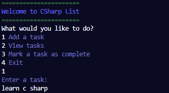
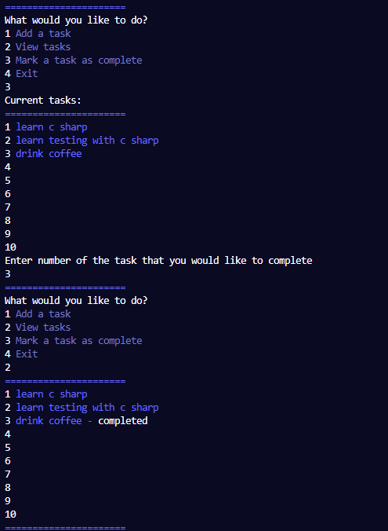
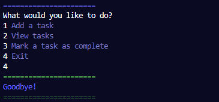

# Overview

This repository contains a CLI Todo List application.

The application is organized into a Program class and a TodoList class.
The Program is responsible for the control flow, whereas TodoList houses the main logic of the app.
The user can add, view and mark tasks as completed.

## Packages
`Pastel` is used to display text in different colours.

## Screen capture

Wecome message

 

View of completed tasks

 

Goodbye message

